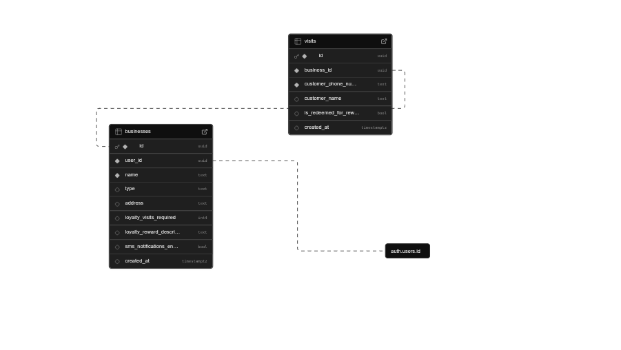

# 💈 LoyalLocal - Phone-Based Loyalty Rewards Platform

A modern, ultra-simple loyalty rewards system designed specifically for local salons, barbershops, and eateries. LoyalLocal eliminates the hassle of traditional punch cards and expensive custom app development by leveraging phone numbers as the primary customer identifier.

## 🎯 Vision

To provide small and medium-sized businesses with an effective, affordable, and easy-to-implement web application that tracks customer visits using phone numbers and rewards customer loyalty, fostering repeat business and stronger customer relationships.

## 🚀 Features

### For Business Owners & Staff

**🔐 Secure Business Management**
- Simple business registration and secure login system
- Business profile setup (name, type, address, contact information)
- Administrative account management

**⚙️ Flexible Loyalty Program Configuration**
- **Stamp-based rewards**: "Every 5th haircut is 50% off" or "Buy 9 coffees, get the 10th free"
- **Points-based system** (planned for v1.1): "$1 spent = 1 point, 100 points = $5 off"
- Customizable reward definitions and thresholds

**👥 Streamlined Customer Management**
- Phone number-based customer lookup and registration
- Instant customer recognition for returning visitors
- Optional customer name collection for personalization
- One-click visit logging and stamp addition

**🎁 Automated Reward Tracking**
- Real-time reward qualification notifications
- Simple reward redemption process
- Automatic visit count reset after redemption

**📊 Business Intelligence Dashboard**
- Active loyalty member count
- Daily, weekly, and monthly visit analytics
- Reward redemption tracking and insights

### For Customers

**📱 Zero-App Experience**
- No app downloads required - just provide your phone number
- Instant enrollment at point of sale
- Automatic progress tracking across visits

**💬 Smart SMS Notifications** *(Optional)*
- Welcome messages for new loyalty members
- Reward earned notifications
- Redemption confirmations
- Opt-in based with full consent management

## 🏗️ Technology Stack

**Frontend**
- HTML5, CSS3, JavaScript
- Responsive web design for all devices

**Backend**
- RESTful API architecture
- JWT-based authentication

**Database**
- Supabase for reliable data management
- Encrypted customer data storage

**Communications (Future Integration)**
- Twilio SMS integration
- Real-time notification system

**Deployment**
-GitHub (currently)
(Future Integration)
- Docker containerization
- Cloud platform deployment (AWS, Google Cloud, or Vercel)
- Scalable infrastructure design

## 🔄 User Flow

### New Customer Experience
1. Customer makes a purchase
2. Staff requests phone number for loyalty program
3. System creates new customer profile (optional name collection)
4. Visit logged with progress indicator
5. Welcome SMS sent (with consent)

### Returning Customer Experience
1. Customer provides phone number at checkout
2. System instantly recognizes customer and displays progress
3. Visit logged automatically
4. Reward notification if threshold reached
5. SMS confirmation sent

### Reward Redemption
1. Staff looks up customer by phone number
2. System displays available rewards
3. One-click reward redemption
4. Visit counter resets automatically
5. Confirmation SMS sent to customer

## 🔒 Privacy & Security

- **Data Protection**: Secure encryption of all customer phone numbers and personal information
- **Consent Management**: Clear opt-in process for SMS communications
- **Privacy Compliance**: Comprehensive privacy policy and GDPR considerations
- **Secure Authentication**: Industry-standard JWT token-based security

## 🚦 Getting Started

### Prerequisites
- Supabase account for database
- Twilio account for SMS functionality

### Installation

```bash
# Clone the repository
git clone https://github.com/Imisioluwa3/LoyalLocal.git

# Navigate to project directory
cd LoyalLocal

run LiveServer to preview website
```

### Configuration

1. **Database Setup**: Configure your Supabase connection in the `.env` file
2. **SMS Service**: Add your Twilio credentials for SMS functionality
3. **Authentication**: Set up JWT secret keys for secure authentication
4. **Business Registration**: Create your first business account through the admin portal

## 📈 Development Roadmap

### Phase 1 - MVP (Current)
- [x] Core loyalty program functionality
- [x] Phone number-based customer management
- [x] Basic SMS notifications
- [x] Simple business dashboard

### Phase 2 - Enhanced Features
- [ ] Customer-facing web portal
- [ ] Advanced analytics and reporting
- [ ] Multi-location business support
- [ ] POS system integrations

### Phase 3 - Advanced Capabilities
- [ ] Targeted SMS marketing campaigns
- [ ] Referral program features
- [ ] Birthday and special occasion rewards
- [ ] Mobile app for customers

## 🤝 Contributing

We welcome contributions from the community! Please read our [Contributing Guidelines](CONTRIBUTING.md) before submitting pull requests.

### Development Process
- Agile methodology with 2-3 week sprints
- Comprehensive testing before feature releases
- User feedback integration and continuous improvement

## 📞 Support

For technical support, feature requests, or business inquiries:
- Email: support@loyallocal.com
- Documentation: [Documentation (PDF)](./assets/LoyalLocal-Documentation.pdf)
- Screenshot: 
- Screenshot: 
- Screenshot: 
- Screenshot: 
- Screenshot: 

## 📄 License

This project is licensed under the MIT License - see the [LICENSE](LICENSE) file for details.

## 🏆 Why Choose LoyalLocal?

**For Businesses:**
- **Cost-Effective**: Fraction of the cost of custom app development
- **Easy Implementation**: Setup in minutes, not weeks
- **No Customer Friction**: Customers don't need to download apps
- **Immediate ROI**: Start seeing increased customer retention right away

**For Customers:**
- **Privacy-Focused**: Minimal data collection, maximum convenience
- **Universal Access**: Works with any phone, no smartphone required
- **Instant Rewards**: Immediate gratification and transparent progress tracking

---

*Built with ❤️ for local businesses everywhere*